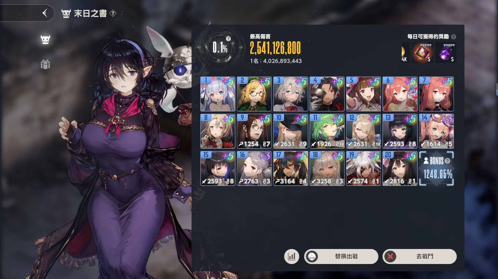

#  棕色尘埃2 自动化工具
棕色尘埃2 自动化工具 Brown Dust 2 Automatic Script Tool:

> 基于openCV的方式通过对屏幕的截图进行计算图形位置进行点击操作
> 由于操作没有打包可以自定义魔改，使用者可能需要熟悉java
> 也可联系我打包处理调试

## 使用方式（仅支持PC端）
> 需要安装java环境:java17（打包成exe不需要jdk）

## 功能一览
* [X] 装备自动合成分解（刷粉，需要自己调节等级）
* [X] 末日之书自动刷分
* [ ] 自动跑图
* [ ] UI脚本制作（制作ing）
* [ ] 兑换码快捷兑换

### 1.装备自动合成分解
> 1.使用时需要打开装备界面，点击进入需要选中需要一键分解的装备，对装备进行设置
>
> 2.设置成全屏（我的是1920 * 1080) ，如果识别不到自己替换即可，替换路径
> /BD2Automatic/images/Equipmentdecomposition/下的图片
>
> 设置图片查看：
>
> 
> 
> 
>
>  说明：先进入装备选择，选择装备（建议是最低级的），在进入装备选择强化等级等(等级建议7级)，在返回装备页面启动脚本即可（第二个也图片的界面）

### 2.末日之书自动刷分

> 1.使用时需要打开末日之书界面，启动程序即可（设置成全屏（我的是1920 * 1080)）
>
> 只需要让程序能够读取到界面中的去战斗即可，或者自己魔改重新截图使用。

## 提醒
* src/main/resources/下的config.properties文件为配置文件，请自行修改。
* src/main/resources/下的logback.xml为日志记录功能可以删除。
* src/main/resources/下的images/Equipmentdecomposition/下的图片为识别图片，如果出现匹配不到图片可以自行更换，但名字需要相同。
* 如果有问题可以及时提交问题，我会及时回复。

## 温馨提示
* 本项目仅用于学习交流，请勿用于商业用途，否则后果自负

